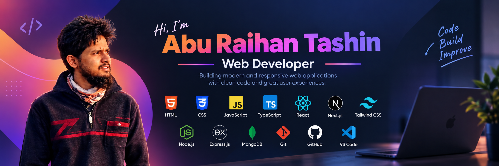

  
<h1> Assalamu'Alaikum, I'm Abu Raihan Tashin</h1>
 
   Web Developer | Building My Skills Step By Step  
  <h6>Learning. Improving. Delivering with integrity.</h6>

---

### 💻 Tech Stack

  

---

### ✨ About Me
> I’m a **Web Developer** focused on building smooth, efficient, and accessible web experiences.  
Currently, I’m sharpening my skills in **frontend development** and learning to write **clean, maintainable code**.  

I’m passionate about understanding **how technology works under the hood** — from client-side interactions to backend logic — as I prepare to step into **app and software development**.  

I aim to deliver **error-free work** while maintaining **high work ethics** and a humble mindset.  
Every project I take on helps me grow a little more. 🌿

---

  

---

⭐ **Thanks for stopping by!** Let’s grow together.  
